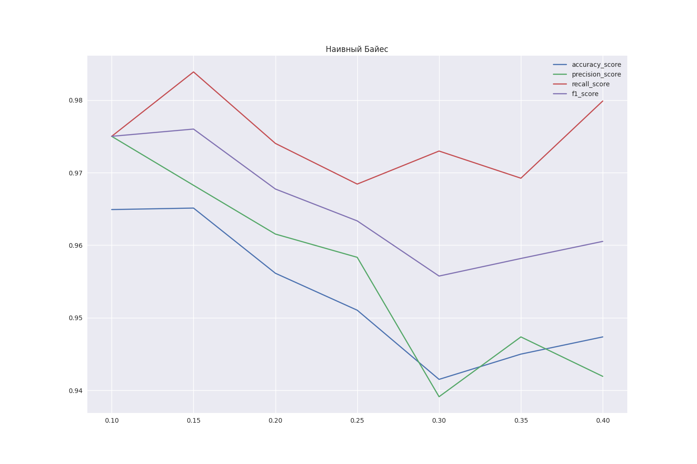

## Отчет

Цель задания - определить зависимость метрик качества от размеров обучающей и тестовой выборки.

В ноутбуке [classification.ipynb](notebooks/Bayes_classifier/classification.ipynb) реализовано определение зависимостей метрик качества модели от размеров обучающей и тестовой выборки. Из графиков, приведенных ниже, видно, что в данном случае оптимальное соотношение обучающей выборки к тестовой 85% к 15%.

