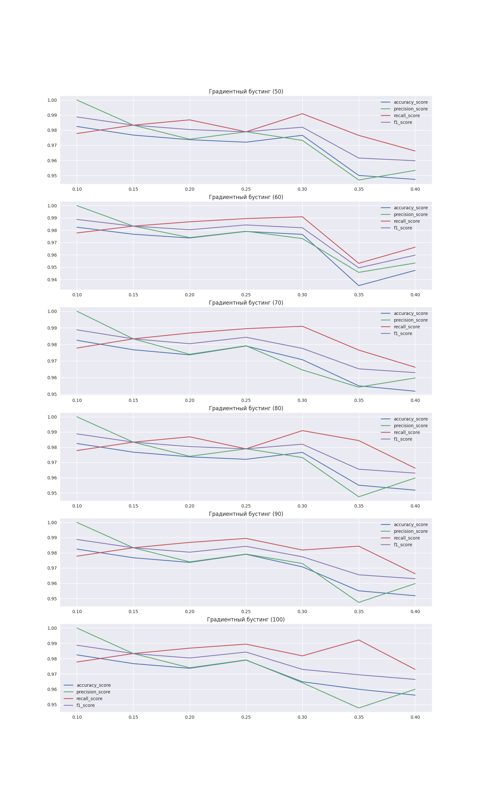

## Отчет

Цель задания - определить зависимость метрик качества от размеров обучающей и тестовой выборки и от количества участников ансамбля.

В ноутбуке [classification.ipynb](notebooks/Decision_tree/classification.ipynb) реализовано определение зависимостей метрик качества модели от размеров обучающей и тестовой выборки и от количества участников ансамбля. Из графиков, приведенных ниже, видно, что размер ансамбля больше 50 мало влияет на метрики, оптимум размеров выборок зависит от того, какая метрика для нас приоритетна.

