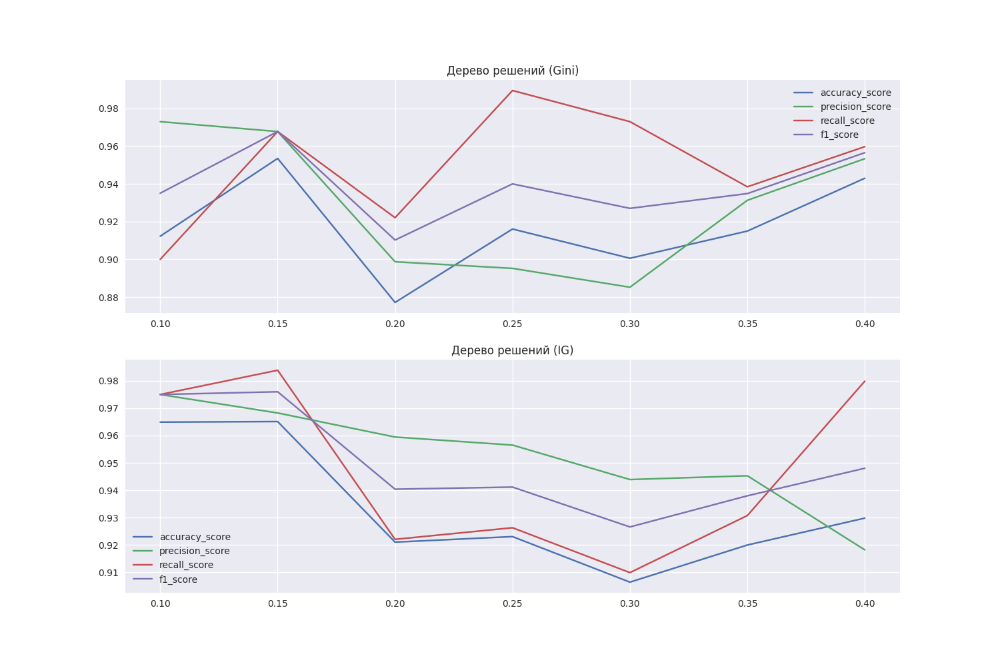

## Отчет

Цель задания - определить зависимость метрик качества от размеров обучающей и тестовой выборки и от критерия разбиения.

В ноутбуке [classification.ipynb](notebooks/Decision_tree/classification.ipynb) реализовано определение зависимостей метрик качества модели от размеров обучающей и тестовой выборки и от критерия разбиения. Из графиков, приведенных ниже, видно, что в данном случае оптимальным критерием разбиения является критерий Джини, размеры выборок - 75% обучающая выборка и 25% тестовая.

